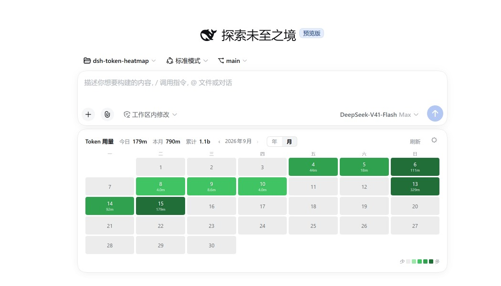
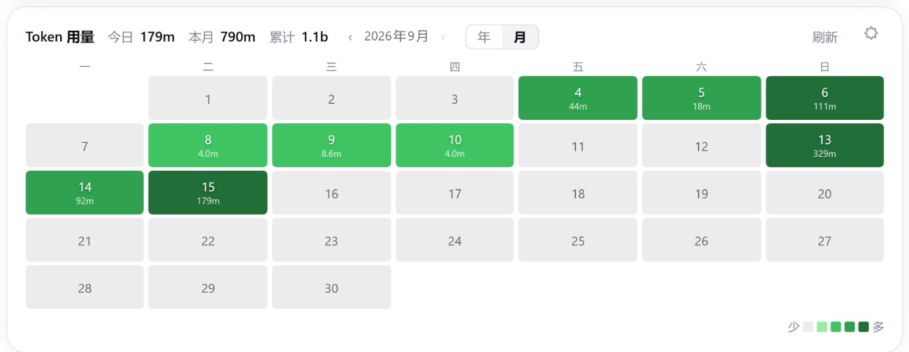
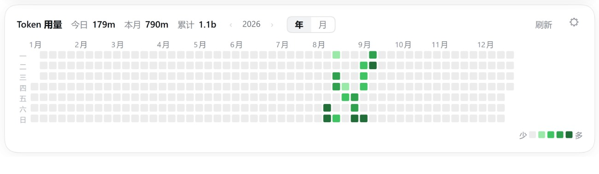
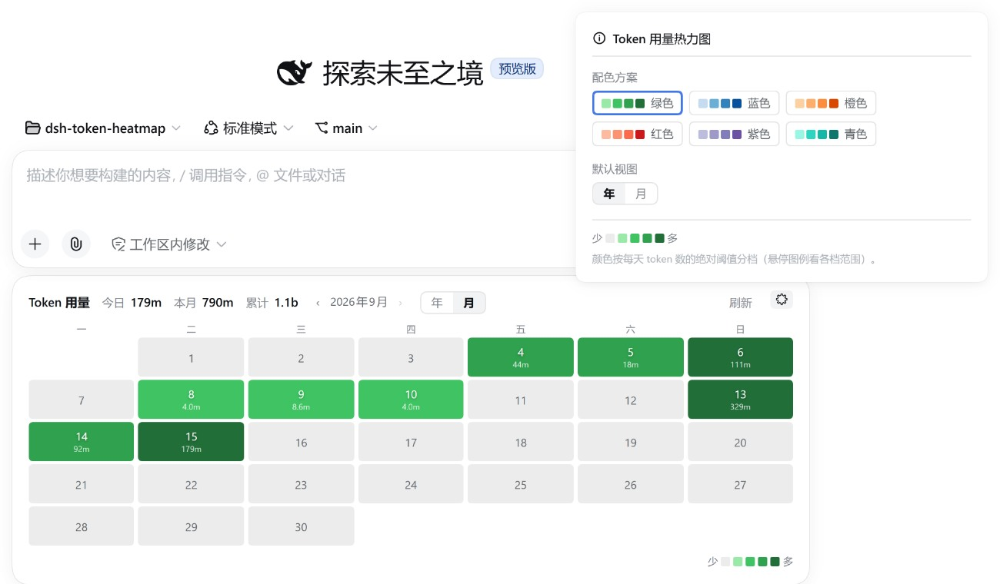

# dsh-token-heatmap

DSH Web GUI 插件：在**新会话（hero）屏幕的输入框下方**显示一个 GitHub 风格的 token 用量热力图 —— 可在**年视图（当前自然年 1月–12月）**与**月视图（单月日历，逐日数值）**之间切换，颜色深浅表示用量多少；同一行展示**今日 / 本月 / 累计** token 用量。**所有设置都在卡片自己身上**（⚙），不在 DSH 设置里。

A DeepSeek Harness web plugin: a GitHub-style daily token-usage heatmap rendered **below the composer input card on the new-session screen only**, switchable between a **calendar-year grid (Jan–Dec)** and a **single-month calendar with per-day numbers**, with today / this-month / all-time totals on the same line. **The card configures itself** (⚙) — nothing lives in DSH settings.

## 界面 / What you get

新会话屏幕输入框正下方出现一张统计卡（**只在新会话显示**；已对话的会话不显示）：



### 月视图 / Month view



单月日历：7 列（周一起，表头一~日）× 5–6 行，每格显示**日号 + 当日 token 数**（如 `4 44m`），底色沿用同一套绝对阈值配色，一眼看出这个月哪几天在烧 token；周末列有浅色底以便区分。标题行的 `‹ 2026年9月 ›` 按**月**步进（最新到本月，最早到有数据的第一天）。

### 年视图 / Year view



GitHub 风格自然年热力图：覆盖所选自然年 1月–12月（`‹ 2026 ›` 按**年**步进，最多到当前年），列为周（周一起），行为星期（左侧标注一~日全部 7 天）；顶部月份标签按列跨度标注（左侧与格线对齐），今日之后的日期显示为空格。

### 共同特性 / Shared

- 🔀 **年 / 月切换**：标题行里的分段按钮即时切换视图（在 `‹ ›` 步进器右边，跟着它一起管当前视图）；`刷新` 与 **⚙** 在行的最右端。
- 🎨 **六套配色**：绿色（经典 GitHub 风格）、蓝色、橙色、红色、紫色、青色，点卡片上的 **⚙** 切换（见下）；颜色按**绝对阈值**分档（按天 token 数，非相对排名）：0 / <1M / 1M–10M / 10M–100M / ≥100M 共 5 级，卡片右下角图例悬停显示各档范围；61M/天 显示为第 3 级。悬停任意格子（年视图的 10px 格子或月视图的日期格）显示日期与精确 token 数。
- 🔢 **统计行**（与标题同一行）：今日 / 本月 / 累计，悬停显示完整数值；本月/累计与当前视图无关，始终是实时值。
- 🔄 自动每 5 分钟刷新，窗口重新可见时也会刷新；行尾可手动刷新。

### 卡片设置 / In-card settings



- ⚙️ **设置就在卡片上**：点标题行最右端的 **⚙**（`刷新 [⚙]`）弹出**悬浮设置面板** —— 位置在 ⚙ 正上方 8px、水平居中对齐、贴边留 12px，超出视口会自动钳制；点面板外的任意位置、按 **Esc**、或再点一次 ⚙ 都会收起。**插件不再往 DSH 设置（设置 → 插件 → 插件配置）里注册任何卡片**，所以那里看不到本插件。
- **配色方案**：六个色板按钮，**点击即时生效**（不需要"保存"）；**默认视图**：年 / 月，决定新会话页面首次打开时显示哪个视图（当次会话手动切换只影响当前页面）。面板底部是阈值图例（悬停看各档范围）与一行说明。
- 写入失败时面板底部会红字提示"保存失败，已回到服务端的值"（settings scope 复核后回滚乐观值）。
- 配置经 `token-heatmap` settings namespace 持久化到 `<DSH_HOME>/settings.yaml`（0.1.1 及更早版本存在 `<DSH_HOME>/storages/token-heatmap-config.json` 的旧配置会在启动时自动迁移）。

## 安装 / Install

需要 `web` profile 与 `pnpm`。DSH 兼容版本见下方「兼容性 / Compatibility」；运行于 `@deepseek-ai/dsh >= 0.1.2-alpha.4`（0.1.2 版本线）。

从 npm 安装：

```powershell
dsh plugin --profile web add @kidli1412/dsh-token-heatmap
```

从 GitHub 安装：

```powershell
dsh plugin --profile web add github:KIDLi1412/dsh-token-heatmap
```

本地开发（手动，本地链接）：

```powershell
dsh plugin --profile web add "link:path/to/dsh-token-heatmap"
```

安装完成后**重启正在运行的 `dsh web`**，并在浏览器中硬刷新（Ctrl+Shift+R）。侧边栏无新增入口——统计卡直接出现在新会话输入框下方。卸载：

```powershell
dsh plugin --profile web remove @kidli1412/dsh-token-heatmap
```

## 工作原理 / How it works

- **服务端**（`lib/index.js` + `lib/usage.js` + `lib/config.js`）：作为 profile bundle 挂载，**实时折叠会话事件**（监听官方 `session/event`，每个 `assistant/chunk`/`assistant/message` 的 `usage` 事件即时写入缓存，不依赖 hero 屏挂载）；启动时一次性补折叠已存在的 live 会话（如 resumed 会话）；请求时 `collectUsage` 再做一次增量同步兜底，并枚举 **已归档（stored）会话**补齐历史——两种 `sessionPersistence` 接口都支持：0.1.2 线的 `listSnapshots()` + `readFrom()`，以及 0.1.3 起取代它们的 `list()` + `open()`/`handle.read()`。同 `(turn, step)` 的重复样本按"替换"语义处理，归属后一天；**fork（`isSeeded`）会话从它的继承切点开始折叠**——日志开头那批属于父会话的事件在父会话侧已折叠，跳过它们才不会把同一批 token 计两次；按天、按模型聚合，缓存到 `<DSH_HOME>/storages/token-heatmap-cache.json`。通过回环受限端点 `GET /api/token-heatmap/usage` 提供；显示配置（配色 + 默认视图）由插件的 `token-heatmap` settings namespace 持有——0.1.5 落 `<DSH_HOME>/settings.yaml`，0.1.7 由插件的 `Config` 导出投影到 profile entry 的 `config:`（`cordis.patch.yml`），两版都经 `settings.describe()` 读、`settings.update()` 写，`GET/POST /api/token-heatmap/config` 作为回环兼容 API 读写同一 namespace（0.1.x 的 `enabled` 开关已废弃，该字段只作为常量 `true` 回给旧客户端），0.1.1 及更早的 `token-heatmap-config.json` 文档在启动时一次性迁移。
- **客户端**（`lib/client.js`）：手写 `__ModuleLoader__` bundle，注册进会话 `conversation.input.dock` 列表插槽，仅在 `session.blank`（新会话 hero 屏；旧宿主回退 `composerPhase === "blank"`）时渲染——卡片没有显示开关，hero 屏上始终显示。框架真正的"卡片下方"插槽 `conversation.composer.dock` 在 hero 屏被 `!hero` 门控禁用，因此本插件利用 `input.dock` 容器（flex 列）的 CSS `order` 把自己排到输入卡片**之后**。同一份数据由 `buildGrid()`（年，53 列 × 7 行）与 `buildMonthGrid()`（月，7 列 × 5–6 行，带日号）两个纯函数分别铺格，共用 `levelOf()` 的绝对阈值分档与 `palette` 配色；`‹ ›` 按钮按当前视图步进年或月，边界取"当前年/月"与"数据里最早的月"，年/月分段按钮紧跟在步进器后面，**⚙ 设置面板**在卡片底部展开（内嵌面板，动作：⚙ 切换 / × / Esc / 焦点移出）。**不注册 `settings.plugin.item`**（官方"插件配置"页签只渲染"Host 实际 serve 的 namespace ∩ 客户端已注册 key"的卡片，本插件不再占这个位置），只经 settings 服务读写 `token-heatmap` namespace（0.1.5 用 `settingsScope.bind()`，0.1.7 用 `configForms.get()`，两者快照与写入接口一致因此 `createConfigStore` 原样复用；该 namespace 仍由服务端注册，是配置的校验与持久化管道）。
- 语义与 `dsh-token-meter` 的 `tokenUsage` 投影一致（参考插件 [dsh-usage-stats](https://github.com/Ychris12138/dsh-usage-stats)，MIT）。

## 说明 / Notes

- 仅回环地址可访问数据端点，凭据不外发；插件只读，不修改任何会话数据。
- 无会话/无工作区时（`input.dock` 需要会话上下文）统计卡不渲染。
- 服务端与客户端都随 `dsh web` 启动加载，因此新增/更新插件后需要重启。

## 兼容性 / Compatibility

- **DSH**：manifest 通过 `dsh.compatibility.dshReleases` 将 **`0.1.5-rc.3`** 与 **`0.1.7-rc.2`** 逐项声明为 `compatible`（DSH STORE 的精确逐版本兼容证据；仅范围声明不会恢复上架）。两版并存靠**能力分流**实现：`inject` 只声明两版交集的服务，`settingsScope`（0.1.5）与 `configForms`（0.1.7）经 `ctx.inject` 条件分支各走一路；服务端按 `typeof ctx.settings.register === "function"` 分流注册，读写统一走两版都有的 `describe()` / `update()`。
- **Node**：`^22.19.0 || >=24.0.0`（与 DSH 一致）。
- **宿主要求（dsh-market 显示）**：`engines.dsh: ^0.1.2-rc.1`，并将运行时依赖的 lockstep 宿主包声明为 `peerDependencies`（`dsh-host-webserver` / `dsh-session` / `dsh-session-persistence` / `dsh-settings` 与客户端模块 `dsh-api-remotes` / `dsh-client-connection` / `dsh-client-locale` / `dsh-client-ui-conversation` / `dsh-client-ui-settings`，均为 `^0.1.2-rc.1`）；插件市场会据此显示"宿主要求"并判断与当前 DSH 是否匹配。
- **依赖**：`@deepseek-ai/dsh-settings` 自 0.1.3 起提升为 `^0.1.2-rc.1`、`@deepseek-ai/schemastery` 提升为 `^3.18.2`，与 DSH 0.1.2 版本线对齐。npm 的 prerelease 解析规则下 `^0.1.0-rc.7` 不会解析到 `0.1.2-rc.1`（只会装 `0.1.0-rc.8`），因此较低的范围会拉到与新版 DSH 不同 train 的 settings 副本。
- **0.1.4（DSH 0.1.2 适配）**：rc.1 起 live session 不再携带 `.events` 数组（改用 `session.seq` + `session.eventAt(seq)`，与官方 `dsh-token-meter` 相同），新会话判断从 `composerPhase === "blank"` 改为布尔 `session.blank`；`sessionPersistence` 的 stored 会话枚举在 0.1.3-alpha.2 被替换（`listSnapshots`/`readFrom` → `list()` + `open()`/`handle.read()`），两条接口见 0.1.6 条目。客户端注入模块列表同步为新架构模块（见上）。
- **0.1.6（session/event 实时折叠 + stored 会话枚举修复）**：`apply()` 注册官方 `session/event` 监听器，每个 usage 事件即时折叠进缓存，解决 live 会话仅在 hero 屏挂载时才折叠而漏计同一日其他会话用量的问题（表现为当日总量偏小、历史天数丢失）；启动时一次性补折叠已存在的 live 会话（如 resumed 会话）。**stored 会话枚举修复**：0.1.3-alpha.2 起 `sessionPersistence` 移除了 `readFrom()` 与 `listSnapshots()`，只保留 `list()` + `open()`/`handle.read()`；旧实现只探测 `list`/`listSnapshots` 却无条件调用 `readFrom`，导致每个 stored 会话抛错并被吞成一条 warn —— 表现为热力图只剩进程内 live 的几天。现在两条接口都支持（`list()` 的 `revision` 同样用于跳过未变更的日志，增量仍按 `seq` 去重与连续性校验），stored 会话可完整补齐历史；两者都不可用时不再误判为"日志被截断"，而是保留已折叠天数并告警。token 口径与 `dsh-token-meter` 一致（input + output + cacheRead + cacheWrite，不含 reasoningTokens）。
- **0.2.0（月视图 + 默认视图设置）**：新增 `buildMonthGrid()` 月视图（周一起、5–6 行、日号 + 当日 token 数）与 年/月 分段切换，`‹ ›` 按当前视图步进年或月；settings namespace 新增 `defaultView`（`"year" | "month"`）字段——与 `colorScheme` 的"只约束 shape"不同，**`defaultView` 是枚举校验**（未知视图没有可回退的渲染器），旧 Host 上该字段会被 schema 丢弃、旧客户端读到未知值时回退为"年"。0.1.x 的 `settings.yaml` 无需迁移（缺字段即取默认 `year`）。
- **0.3.0（设置卡精简 + 年/月切换移到行尾）**：年/月分段按钮从统计行中间移到**标题行最右端**（刷新按钮右边）；**删除"显示热力图"总开关**——`enabled` 不再是 settings schema 的字段，schema 解析时该键原样透传但不被读取（schemastery 不丢弃未声明键，`settings.yaml` 里的旧 `enabled` 会留着且无效，保存配置卡时被自动清掉）；`GET/POST /api/token-heatmap/config` 仍以常量 `true` 回该字段，使 0.1.x 客户端不会因这次改动把卡片藏起来。0.2.0 的月视图与默认视图设置作为同一批未发布改动一并发布。
- **0.4.0（设置搬进卡片）**：不再注册官方 `settings.plugin.item` 插槽——设置页（设置 → 插件 → 插件配置）里不再有本插件的卡片，配色与默认视图改在卡片自己的 ⚙ 面板里改，**点击即时生效**（去掉了草稿/保存/放弃那套）。Host 侧 `settings.register("token-heatmap", schema)` 保留：它是 settings.yaml 的校验与持久化管道，与 UI 卡片无关（官方 `settings` 服务的 `get`/`update` 只对已注册 namespace 生效）。升级只影响设置入口位置，已有配置不动。

- **0.4.1（fork 会话不再重复计入父会话用量）**：DSH 的 fork 子会话（header `isSeeded=true`）日志以父会话事件的完整复制开头，其前 `inheritedEventCount` 个事件是**父会话**的 usage（父会话折叠时已计入）。此前折叠从 seq 0 读整份日志，同一批 token 被计两次——实测 2026-09-14 由 8.34 亿虚增到 13.15 亿。现在三条折叠路径（`collectUsage` 的 live 折叠、`session/event` 实时监听、stored 日志读取）都从 fork 切点开始：live 会话用官方 `session.inheritedEventCount`；stored 日志用最后一个带 `data.inherited === true` 的 `session/end-seed` 的 `seq + 1`（未打标记的 `session/end-seed` 是 compaction 边界，不算切点，与 `dsh-session-format-v2-to-v3` 的切点推导一致）。**resume 不是 fork**：`isSeeded=false` 的会话种子是它自己的历史，仍整份折叠。缓存格式版本提升到 2，旧缓存（可能含重复计入的天数）会被丢弃重建；父会话日志不可得的极端情况下会少计而非多计。
- **0.4.2（设置改成悬浮面板）**：⚙ 面板从"卡片底部的内嵌条"改为**悬浮面板**——portal 到 `document.body`、`position:fixed`，锚在 ⚙ 上方 8px 且水平居中对齐，按视口钳制（12px 边距），关闭方式为点外部/Esc/再点 ⚙；表面沿用 DSH 原生弹层 token（`--dsw-specific-menu` + `--dsw-elevation-prominent`，配合 `--dsw-elevation-stroke-color` 的发丝边），与底部统计 pill 的弹层一致。为此客户端 bundle 新增 `require("react-dom")`（原生的 `createPortal`），DSH 的模块图里 react-dom 一直存在，旧宿主不受影响。
- **0.4.3（兼容 DSH 0.1.5-rc.3 与 0.1.7-rc.2）**：DSH 0.1.7 重写了 settings —— `ctx.settings` 不再提供 `register()` / `get(ns)`，客户端 `settingsScope` 改名 `configForms`，配置 schema 改从插件的 `Config` 导出投影。本版把 `inject` 收敛为两版交集，服务端按能力分流注册（0.1.5 走 `register()` + 旧文档迁移；0.1.7 走 `Config` + `settings.configure({auto:false})`），客户端两条条件注入分支分别绑 `settingsScope.bind()` 与 `configForms.get()`——两者快照与写入接口一致，`createConfigStore` 原样复用，**⚙ 面板在两版都能读写配置**。schemastery 3.18.2（0.1.5 自带）没有 `.volatile()`，故 volatile 标记写作 `extra("volatile", true)`（在 3.18.4 上等价，并把解析结果包成 `Volatile<T>`，由 0.1.7 的 `plainConfig()` 解包）。两版配置**存储位置不同**：0.1.5 落 `<DSH_HOME>/settings.yaml`，0.1.7 落 profile `cordis.patch.yml` 中该条目（entry id 同为 `token-heatmap`）的 `config:` 字段，0.1.5→0.1.7 由 DSH 自身的 `importLegacyDocument` 搬迁。另修复 `reload()` 调用两版都不存在的 `scope.load()` 导致的报错。

## License

MIT。聚合与回环端点实现参考了 [dsh-usage-stats](https://github.com/Ychris12138/dsh-usage-stats)（MIT © Ychris12138）。
